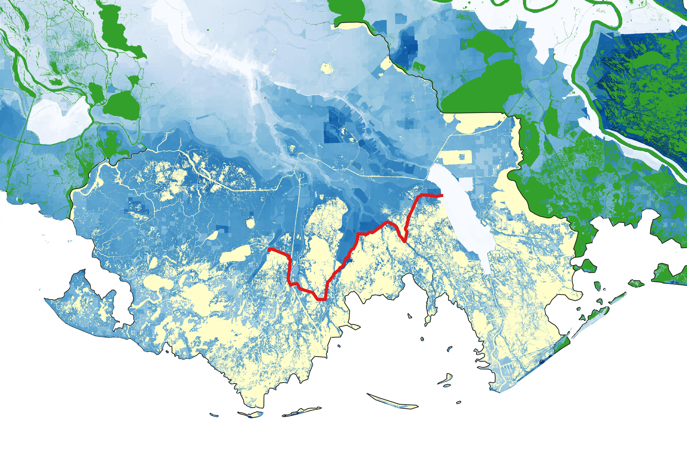

# Analyzing Future Population Impacts from the Morganza to the Gulf Levee in Louisiana
## Abstract
The Morganza to the Gulf Levee is an ongoing major levee project in Southern Louisiana, designed to provide flood protection to Terrebonne and Lafourche parishes. This a jointly funded project between the State and Federal government totaling $10.2B through the life of the project. While construction has begun on the state-funded aspects of the levee, the federal-funded portions have not yet been built. The below map shows the location of the levee in red, along with the Terrebonne and Lafourche parishes in yellow.


This project seeks to predict how populations behind the levee are likely to change as a result of the construction of the levee and what risks they might face as a result of climate change. The perceived safety from natural disasters for the areas behind the levee may induce population growth in those areas. If the levee is not adequately designed to protect against the threats of climate change, this induced population growth will put additional people at risk of hazards from intense storms, hurricanes, and flooding.

 To work towards this prediction, these scripts build up to a regression used to reverse engineer the population estimates provided by the state under a future without action scenario. In future stages of this project, this regression will be further polished and a counterfactual will be built with how the levee changes the flood estimates for inundation and storm surge. This counterfactual will be used with the regression to estimate the population change induced by the levee.

## Data
The primary data source for this project is the Louisiana Coastal Master Plan Data Portal. The Louisiana Coastal Protection and Restoration Authority prepared this data portal to analyze and visualize the impact of projects within the 2023 Coastal Master Plan, which the Morganza to the Gulf Levee is a part of. The data available includes decadal projections between now and 2055 for a wide range of scenarios including higher and lower sea level rise scenarios, annual exceedance probabilities,and Shared Socioeconomic Pathways (SSPs), and projections with the master plan or a future without action. The data portal can be found [here](https://mpdap.coastal.la.gov/?_gl=1*1s2bb2z*_ga*MTA0MTE2OTQ5My4xNzM4ODk1MDE0*_ga_QXZEQ3TW20*MTc0NjQwMjM1NC4xOC4wLjE3NDY0MDIzNTQuNjAuMC4w). The following data sets were downloaded from this portal. Each scenario must be downloaded separately:

1. TIF files of flood depths (from storm surge, measured in feet), Annual Exceedance Probability of 1:
    + Higher sea level rise, year 12, with plan
    + Higher sea level rise, year 12, without plan
    + Higher sea level rise, year 52, with plan
    + Higher sea level rise, year 52, without plan
    + Lower sea level rise, year 12, with plan
    + Lower sea level rise, year 12, without plan
    + Lower sea level rise, year 52, with plan
    + Lower sea level rise, year 52, without plan

2. CSV files of inundation depths (average annual water levels, measured in meters):
    + Higher sea level rise, year 12, with plan
    + Higher sea level rise, year 12, without plan
    + Higher sea level rise, year 52, with plan
    + Higher sea level rise, year 52, without plan

3. CSV file of decadal population change from present to 2055 for a future without action. There is no available projection for a future under the Coastal Master Plan.

4. Model Geometries Geopackage - used for inundation points and Louisiana parish shapefiles

The other main data source was the U.S. Census Bureau, including:

1. 2019 Louisiana Block Groups, Cartographic Boundary Shapefile (download [here](https://www.census.gov/geographies/mapping-files/time-series/geo/cartographic-boundary.2019.html#list-tab-1883739534))

2. 2023 U.S. Counties, Cartographic Boundary Shapefile (download [here](https://www.census.gov/geographies/mapping-files/time-series/geo/cartographic-boundary.2019.html#list-tab-1883739534))

3. 2024 Area and linear hydrography, TIGER/Line Shapefiles for the following 25 parishes. This list of parishes is produced in script 5. (download [here](https://www.census.gov/cgi-bin/geo/shapefiles/index.php?year=2024&layergroup=Water)):
    + Calcasieu
    + Tangipahoa
    + Vermilion
    + St. Bernard
    + Iberville
    + St. Martin
    + St. Landry
    + Pointe Coupee
    + St. James
    + Plaquemines
    + Avoyelles
    + Assumption
    + Jefferson
    + St. Tammany
    + Cameron
    + Iberia
    + Terrebonne
    + St. John the Baptist
    + St. Mary
    + Lafourche
    + Livingston
    + West Baton Rouge
    + Orleans
    + Ascension
    + St. Charles

Additionally, to map the reaches of the planned levee system, I used a GeoJSON file from the U.S. Army Corps of Engineers National Levee Database, which can be downloaded [here](https://levees.sec.usace.army.mil/levees/300005009619).

Finally, I used a shapefile from the Louisiana Coastal Protection and Restoration Authority for the boundaries of the Coastal Management Zone, which can be downloaded [here](https://www.dnr.louisiana.gov/page/coastal-zone-boundary-2012).

## Scripts

This repository contains 12 scripts which should be run in the following order:

1. base_geom.py: This script sets up the project geopackage with base layers including an outline of Louisiana, block groups, the MTG levee system, and Terrebonne and Lafourche parishes.

2. blockgroupCMZ.py: This script produces a layer for the project geopackage of the block groups within the Coastal Management Zone. As the boundaries do not align, any block group that has at least 25% of it's area inside the zone is included.

3. pop_by_ssp_year.py: This script reads in the population dataset and breaks it down into scenarios by SSP and year with a file for each combination.

4. pop_geom.py: This script uses the SSP 2 scenario for years 12 and 52. It filters down these datasets to the scenarios which will be used for the remainder of the analysis which is the Base migration scenario, value 50 (median of the projections), for higher and lower sea level rise. It then merges the population data onto the block group shapefiles, and saves the high and low sea level rise scenarios as layers in the project geopackage.

5. points_in_water.py: The inundation flood data is measured from extraction points across the state. Many of the extraction points are within bodies of water, which would cause misleading measurement of flood levels for the purposes of this analysis. This script locates the points found in bodies of water and removes them from the spatial dataset that will be used to merge onto the inundation points in the next script.

6. inun_geom.py: This script merges the year 12 and 52 data projections for inundation levels for high and low sea level rise scenarios. It then merges it onto the filtered extraction points and saves each scenario to a layer in the project geopackage.

7. inun_pop_by_bg.py: This script
merges the population and inundation datasets together for high and low sea level rise scenarios using a spatial join. It then calculates the percent of each block group that is flooded more than 0.5 meters in a given year. It calculates the change in percent flooded from year 12 to 52 and the change in population from year 12 to 52 and saves each scenario to a layer in the project geopackage.

8. inun_pop_plots.py: This script creates boxen plots and scatter plots showing the relationship between population change and inundation change for high and low sea level rise scenarios.

9. storm_surge.py: To process the data in the raster TIF files, I used GIS's raster analysis zonal statistics tool to find the median storm surge by block group for each scenario. This returned csv files for each scenario which are included in the repository. This script uses these csv files and merges the year 12 and 52 data, then calculates the change in storm surge across this time period for each scenario. It saves each scenario as a separate file to be used later in the analysis.

10. census.py: This script builds an API key to extract variables from the census for all block groups and tracts in Louisiana to be used in the population regression. It then calculates rates from the variables extracted including the poverty rate, fertility rate, and unemployment rate. As the fertility variables are not available at the block group level, the rate calculated from the census tract level data is assumed to be representative of the block group rates.

11. reg_variables.py: This script joins the inundation and population dataset, the census dataset, and the storm surge data set to prepare for the population regression. This script only includes variables for the higher sea level rise scenario

12. regression.py: This script runs a preliminary regression to attempt to determine the inputs for the state's population projection for a future without action under a higher sea level rise scenario. Before running the regression, it sets up indicator variables that equal 1 if the block group is at risk for any inundation or storm surge flooding, which are subsequently used in the regression.

## Preliminary Results
The following maps were built in QGIS by reading the flood depth TIF files in as raster layers with
the project geopackage. The raster values are styled as paletted/unique values with value "-9998" dropped as this was the code for water bodies. The first two maps shows the storm surge under a higher sea level rise scenario in year 52 in a future without action. The levee is marked here for comparison, but under this scenario, there would not be a levee.



These maps show a storm surge of approximately 20 feet in the area that would directly behind the levee.

These next two maps shows the storm surge under the same scenario of higher sea level rise in year 52, except these are under a future with the levee.


These maps show a storm surge of approximately ten feet in the areas directly behind the levee. The differences in these maps between a future without a levee and a future with, show that the levees do significantly reduce the harm from storm surge. However, ten feet of flooding is still incredibly dangerous and could cause extreme damage. These maps display that if there is large predicted population growth in the areas behind the levee, there will be increased damages as this population will not be fully protected from catastrophic storm surge by 2055.


This boxen plot and scatter plot shows the relationship between population change and inundation change between 2035-2055 under a high sea level rise scenario. There is a general trend of decreasing population as inundation gets worse. However, there is a strange pattern shown when a block group goes from not flooded to 100% flooded. There are several instances here of increased population. Upon further inspection, this appears to be partially driven by block groups that have very small actual changes in population (such as from 13 people to 14 people), but that show up as large percentage change. This finding led to the decision to move ahead with logged population numbers rather than population change as a ratio in the regression.

```python
                            OLS Regression Results                            
==============================================================================
Dep. Variable:              ln_pop_52   R-squared:                       0.906
Model:                            OLS   Adj. R-squared:                  0.900
Method:                 Least Squares   F-statistic:                     131.7
Date:                Sun, 04 May 2025   Prob (F-statistic):           7.86e-65
Time:                        23:01:31   Log-Likelihood:                -168.59
No. Observations:                 147   AIC:                             359.2
Df Residuals:                     136   BIC:                             392.1
Df Model:                          10                                         
Covariance Type:            nonrobust                                         
=======================================================================================
                          coef    std err          t      P>|t|      [0.025      0.975]
---------------------------------------------------------------------------------------
const                  -9.7406      0.627    -15.530      0.000     -10.981      -8.500
inun_risk              -0.1370      0.872     -0.157      0.875      -1.861       1.587
ss_risk                -0.0274      0.263     -0.104      0.917      -0.547       0.492
inun_risk_x_ss_risk     0.0835      0.884      0.094      0.925      -1.664       1.831
flood_change         5.403e-05      0.005      0.010      0.992      -0.010       0.010
ss_change              -0.0038      0.028     -0.138      0.890      -0.058       0.051
ln_pop_12               2.2428      0.067     33.357      0.000       2.110       2.376
unemploy_rate           0.0034      0.014      0.233      0.816      -0.025       0.032
poverty_rate            0.0033      0.008      0.431      0.667      -0.012       0.019
fertility_rate          0.0094      0.014      0.656      0.513      -0.019       0.038
median_inc          -1.384e-06   3.84e-06     -0.361      0.719   -8.97e-06     6.2e-06
==============================================================================
Omnibus:                       25.737   Durbin-Watson:                   1.972
Prob(Omnibus):                  0.000   Jarque-Bera (JB):               74.174
Skew:                          -0.627   Prob(JB):                     7.82e-17
Kurtosis:                       6.246   Cond. No.                     1.15e+06
==============================================================================
```
The preliminary regression only finds a significant relationships between the logged population in year 52 with the logged population in year 12, which is not a surprising finding. Further experimentation needs to be undertaken to determine what variables were used in to project the population numbers under a future without action scenario. Additionally, some block groups only contain one inundation point. Therefore, further quality control needs to be undertaken using topographical analysis to determine if these points are accurately capturing the elevation of a block group.
